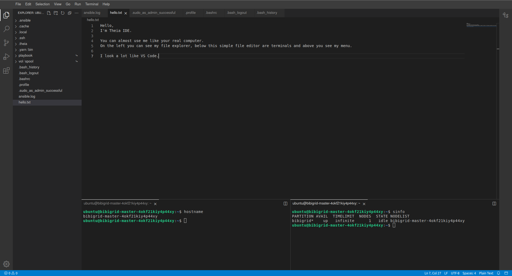

# BiBiGrid Hybrid- and Multi-Cloud Hands-on

This tutorial is a reworked/optimized version of the Hands-on session of the [**Cloud User Meeting: BiBiGrid Hands-on**](https://github.com/deNBI/bibigrid_clum) based on the latest release of BiBiGrid.

## Prerequisites

- System base on Linux, OSX (tested) or Windows Subsystem for Linux (untested)
- required software packages 
  - Python > 3.6  
  - git (required)
  - openssh 
- Openstack API access to two clouds

## Download BiBiGrid
```shell
git clone https://github.com/BiBiServ/bibigrid.git
cd bibigrid
```

The following steps assume that you are inside of the bibigrid folder. It should contain:

```
$ ls
bibigrid  bibigrid_rest.sh  bibigrid.sh  bibigrid.yml  documentation  README.md  requirements-dev.txt  requirements-rest.txt  requirements.txt  resources  tests
```

## What will happen...

The goal of this session is to set up a small Hybrid- or Multi-Cloud HPC cluster consisting of 6 nodes (Cloud 1: 1 master, 2 workers, Cloud 2: 1 vpn-worker, 2 workers) using BiBiGrid with [Slurm](https://slurm.schedmd.com/quickstart.html) (workload manager), [Network File System](https://linux.die.net/man/5/nfs) (allows file sharing between servers) and [Theia](https://theia-ide.org/docs/user_getting_started/) (Web IDE). The cluster is spanned over all clouds via [Wireguard](https://www.wireguard.com/).

1. [Preparation](#preparation)
2. [Configuration](#configuration)
3. [The Cluster](#the-cluster)

## Preparation

### Premade Template

Use the prefilled configuration template [resources/bibigrid.yml](resources/bibigrid.yml) as a basis for your personal BiBiGrid configuration. It contains two list elements. The first element is for the first cloud, the second element for the second.

Later in this tutorial you will use [OpenStackClient](https://pypi.org/project/python-openstackclient/) or access 
Openstack's dashboard manually to get all necessary configuration information from your project.

Copy the [configuration template](resources/bibigrid.yml) to `~/.config/bibigrid/`.

```shell
mkdir ~/.config/bibigrid
cp resources/bibigrid.yml ~/.config/bibigrid/bibigrid.yml
```

### Authentication

In this section you will create an [application credential](https://access.redhat.com/documentation/zh-cn/red_hat_openstack_platform/14/html/users_and_identity_management_guide/application_credentials) for each cloud and download the autogenerated `clouds.yaml`s. `clouds.yaml`s contain all required authentication information. Follow the steps shown in the images:


Don't use the input field secret.
- Its input is not hidden
- OpenStack will generate a strong secret for you, if you leave it blank.

Pick a sensible expiration date.


#### Merge The Clouds.yamls
In order for OpenStack and BiBiGrid to be able to access both `clouds.yaml` files you need to merge them. For that you simply copy one `openstack:` definition to the other `clouds.yaml` and give both a unique name. The final result looks something like this:

```yaml
clouds:
  openstack_cloud1:  # pick a more fitting name for example openstack_bielefeld if that cloud runs in bielefeld
    [...]

  openstack_cloud2:  # pick a more fitting name for example openstack_giessen if that cloud runs in giessen
    [...]
```
In the following the first cloud is called `openstack_cloud1` and the second `openstack_cloud2` (you may pick more descriptive names).

Safe the **merged** `clouds.yaml` under `~/.config/openstack/` **and** `~/.config/bibigrid/`. That will allow both OpenstackClient and BiBiGrid to access it.

<details>
<summary>Why not store BiBiGrids `clouds.yaml` in openstack and save the extra copy?</summary>

In the future BiBiGrid will support more than just one cloud infrastructure. Therefore, using the `~/.config/openstack` folder would be a disadvantage later.
</details>


### Virtual Environment

A virtual environment is something that gives you everything you need to run specific programs without altering your system.

#### Creating a [Virtual Python Environment](https://docs.python.org/3/library/venv.html)

`python3 -m venv ~/.venv/bibigrid`

#### Sourcing Environments

In order to actually use the virtual environment we need to [source](https://www.theunixschool.com/2012/04/what-is-sourcing-file.html) that environment:

`source ~/.venv/bibigrid/bin/activate`

Following [pip](https://manpages.ubuntu.com/manpages/bionic/en/man1/pip.1.html) installations will only affect the virtual environment. The virtual environment is only `sourced` in the terminal where you executed the source command. Other terminals are not affected.

#### Fulfilling Requirements

You will now install packages required by BiBiGrid within your newly created virtual environment. If you haven't `sourced` your environment yet, please go [back](#sourcing-environments). To install all BiBiGrid requirements, we simply install from the given requirements file:

`pip install -r requirements.txt`

Try executing `openstack subnet list --os-cloud=openstack_cloud1` and `openstack subnet list --os-cloud=openstack_cloud2` within this environment. If it runs without errors, you are ready to proceed. Otherwise you need to check your merged `clouds.yaml` and your virtual environment.

## Configuration

Following the next steps you will update the [premade template](#premade-template). It contains a list. The first element is the configuration for the cloud where the master runs. The second configuration is for another cloud - where a vpn worker is created to establish the connection. While there are optional keys that are once set for both clouds, all keys below need to be set for the clouds individually if not stated otherwise.

As most resources (images, flavors, ...) are named differently on each cloud, we need to define resources for each cloud individually.

You set all of the following keys in your `~/.config/bibigrid/bibigrid.yml` file. 

### Cloud
You need to set the cloud keys to their respective name in the merged `cloud.yaml` to enable BiBiGrid to read the correct `clouds.yaml` authentication information.

```yaml
[...]
- infrastructure: openstack # former mode.
  cloud: openstack_cloud1 # name of clouds.yaml entry; you should pick a more fitting name

- infrastructure: openstack # former mode.
  cloud: openstack_cloud2 # name of clouds.yaml entry; you should pick a more fitting name
```

### SSH access information

BiBiGrid needs to know which [sshUser](https://www.redhat.com/sysadmin/access-remote-systems-ssh) to use in order to connect to your master.

The [sshUser](https://www.redhat.com/sysadmin/access-remote-systems-ssh) depends on your server image. Since we run on top of Ubuntu 22.04 the ssh-user is `ubuntu`. Set the template's `sshUser` key to `ubuntu`.

This is done for both configurations.

### Network

Determine your clouds' subnet `Name`s by running:

```
openstack subnet list --os-cloud=openstack_cloud1
openstack subnet list --os-cloud=openstack_cloud2
```

Those commands each return the subnets of their respective cloud. Set the template's `subnet` keys to the respective results' `Name` key. Make sure that you use a subnet from the first result for the first cloud and a subnet from the second result for the second cloud.

### Instances

BiBiGrid needs to know `type` (often also called flavor) and `image` for each server. Since those are often identical for multiple workers, 
you can simply use the `count` key to indicate multiple workers with the same `type` and `image`.

#### Image
Images are virtual disks with a bootable operating system. Choosing an image means choosing the operating 
system of your server.

Since [images](https://docs.openstack.org/image-guide/introduction.html) are often updated, you need to 
look up the current active image using:

```shell
openstack image list --os-cloud=openstack_cloud1 | grep active
openstack image list --os-cloud=openstack_cloud2 | grep active
```

Since we will use Ubuntu 22.04 you might as well use:

```shell
openstack image list --os-cloud=openstack_cloud1 | grep active | grep "Ubuntu 22.04"
```

Set the template's `image` key of all instances of cloud1 (first configuration) to the result's `NAME` entry of the Ubuntu 22.04 row. Repeat the same for cloud2 (second configuration):

```shell
openstack image list --os-cloud=openstack_cloud2 | grep active | grep "Ubuntu 22.04"
```

and set it accordingly.

<details>
<summary>Do I have to update my configuration file whenever there is a new image version?</summary>

If you use the method described above, yes. However, you can also use a regex instead of a specific name to select an image during runtime. This has also avoids issues that may arise whenever an image is deactivated while your cluster is still running. For our Ubuntu 22.04 images you could use `^Ubuntu 22\.04 LTS \(.*\)$`, but usually you need to check what image names are available at your location and choose the regex accordingly. For more information on this functionality take a look at BiBiGrids [full documentation](https://github.com/BiBiServ/bibigrid/blob/master/documentation/markdown/features/configuration.md#using-regex).
</details>

#### Flavor

Flavors are available hardware configurations.

The following gives you a list of all flavors:

```shell
openstack flavor list --os-cloud=openstack_cloud1
openstack flavor list --os-cloud=openstack_cloud2
```

Set the template's `flavor` keys to the `NAME` of the flavor of your choice. You can use a different flavor for master, vpnwkr and each worker-group. Make sure to only use flavors from openstack_cloud1 for the first configuration and flavors of openstack_cloud2 for the second configuration.

#### Multiple worker groups

The key `workerInstances` expects a list. Each list element is a `worker group` with an `image` + `type` combination and a `count`. In our tutorial we use a single worker group containing two workers on the first cloud and two worker groups each containing a single worker on the second cloud. Since they are in the same worker group, they are identical in flavor and image. We could, however, define two worker groups with one worker each in order to use different flavors for them.

```yaml
- [...]
  workerInstances:
    - type: # enter a flavor available on this cloud here
      image: # enter an image available on this cloud here
      count: 2
  [...]
- [...]
  workerInstances:
    - type: # enter a flavor available on this cloud here
      image: # enter an image available on this cloud here
      count: 1
      features:
        - some_feature
    - type: # enter a flavor available on this cloud here
      image: # enter an image available on this cloud here
      count: 1
  [...]
```

You can ignore the `features` key for now. If you are interested, you can read [What's the meaning of the feature key?](#features) later.

### Waiting for post-launch Services (only for first cloud)

Some clouds run one or more post-launch services on every started instance, to finish the initialization after an 
instance is available (e.g. to configure local proxy settings or local available repositories). That might interrupt 
BiBiGrid node setup. Therefore, BiBiGrid needs to wait for those post-launch service(s) to finish. For that BiBiGrid needs the 
services' names. Set the key `waitForServices` to the list of services you would like to wait for.

For example 
```yaml
  - [...]
    waitForServices: 
      - cloud1.service
  - [...]
    waitForServices: 
      - cloud2.service
```

If you have no such services, you can simply omit the key.

### Check Your Configuration
Run `./bibigrid.sh -i bibigrid.yml -ch -v` to check your configuration. The command line argument 
`-v` allows for greater verbosity which will make it easier for you to fix any configuration issues. If the error doesn't seem helpful, make sure the file's indentation is correct.

## The Cluster
### Starting the cluster
`./bibigrid.sh -i bibigrid.yml -c -v` creates the cluster with a more verbose output. Cluster creation time 
depends on the chosen flavor and the overall load of the cloud and will take up to 15 minutes.

### Cluster SSH Connection

After a successful setup, BiBiGrid will print some useful information:

```
Cluster 6jh83w0n3vsip90 with master 123.45.67.890 up and running!
SSH: ssh -i '~/.bibigrid/tempKey_bibi-6jh83w0n3vsip90' ubuntu@123.45.67.890
Terminate cluster: ./bibigrid.sh -i 'bibigrid.yml' -t -cid 6jh83w0n3vsip90
Detailed cluster info: ./bibigrid.sh -i 'bibigrid.yml' -l -cid 6jh83w0n3vsip90
```

You can now establish an SSH connection to your cluster's master by executing the `SSH` line of your `create`'s 
output: 
```shell
ssh -i '~/.bibigrid/keys/tempKey_bibi-6jh83w0n3vsip90' ubuntu@123.45.67.890 
```
But make sure to use the one generated for you by BiBiGrid since 

- cluster-id (here `6jh83w0n3vsip90`), 
- key name (here `~/.config/bibigrid/keys/tempKey_bibi-6jh83w0n3vsip90`) 
- user@IP (here `ubuntu@123.45.67.890`) 

will differ on every run. Run `sinfo` after logging in. You should see something like this:

```
PARTITION                 AVAIL  TIMELIMIT  NODES  STATE NODELIST
openstack_cloud1             up   infinite      3  idle~ bibigrid-worker-6jh83w0n3vsip90-[0-1]
openstack_cloud1             up   infinite      1   idle bibigrid-master-6jh83w0n3vsip90
openstack_cloud2             up   infinite      4  idle~ bibigrid-worker-6jh83w0n3vsip90-[2-3]
All*                         up   infinite      7  idle~ bibigrid-worker-6jh83w0n3vsip90-[0-6]
All*                         up   infinite      1   idle bibigrid-master-6jh83w0n3vsip90

```

<details>
<summary>Why are there two partitions (openstack and all) with the same nodes?</summary>

#### Partitions

BiBiGrid creates one partition for every cloud (here `openstack`) and one partition called `all` containing all nodes from all partitions. Since we are only using one cloud for this tutorial, we only have `openstack` and `all`.
</details>

<details>
<summary>What's the meaning of the feature key?</summary>

#### Features
Run `sinfo -o "%35n  %20P %10c  %10m  %25f"`. You should see something like this (skipping the *all partitions):

```
HOSTNAMES                            PARTITION            CPUS        MEMORY      AVAIL_FEATURES
bibigrid-worker-25r4w0fwfxxt27b-0    openstack_cloud1     1           1000        (null)                   
bibigrid-worker-25r4w0fwfxxt27b-1    openstack_cloud1     1           1000        (null)           
bibigrid-master-25r4w0fwfxxt27b      openstack_cloud1     4           3500        (null)                   
bibigrid-worker-25r4w0fwfxxt27b-2    openstack_cloud2     1           1000        some_feature, some_database
bibigrid-worker-25r4w0fwfxxt27b-3    openstack_cloud2     2           1000        some_database          
[...]
```

As you can see features were assigned depending on where they have been pre-written in the configuration. If written at instance level, only those instances have the feature. If written in the 
</details>

However, doing everything on the running cluster from a terminal can be quite bothersome. That's were Theia comes in.

### Using Theia Web IDE

[Theia Web IDE's](https://www.theia-ide.org/) many features make it easier to work on your cloud instances. Take a look:




When enabled, Theia Web IDE is configured to listen on localhost port 8181 on the master instance. Since this address 
is not directly available you have to forward it to your machine using ssh. Execute 

```shell
./bibigrid.sh -i bibigrid.yml -ide -cid [cluster-id]
```

to connect to Theia. You may even use `./bibigrid.sh -i bibigrid.yml -ide` since BiBiGrid will attempt to connect to your last created cluster if no cluster-id is given. Theia will be run as `systemd service` on localhost. A Theia IDE tab will be automatically opened in your browser.

## Hello BiBiGrid, Hello Antibiotic Resistance!

In this section, you will execute the `resFinder` workflow to create a heatmap of antibiotic resistances using your cluster. We will only focus on the workflow language [Nextflow](https://www.nextflow.io/) within this tutorial. However, you could use any software that comes with a SLURM executor instead or even run the jobs directly through SLURM's CLI.

<details>
<summary>Digression: Job Scheduling (SLURM)</summary>

[Slurm](https://slurm.schedmd.com/) is used for job scheduling/workload management. To see all nodes in your cluster execute `sinfo`. You will notice that workers are `idle~`. That means they are `idle` and `~` (powered down). Slurm uses many symbols and words to indicate node states. See [here](https://slurm.schedmd.com/sinfo.html#SECTION_NODE-STATE-CODES) for more about that. To see all running jobs, execute `squeue`. You will notice that no job is currently running.

After successfully connecting to Theia IDE, we will now run our first job on our cluster. Let's start with a "hello world".

- Open a terminal
- Create a new shell script `nano /vol/spool/helloworld.sh`:

```shell
#!/bin/bash
echo Hello from $(hostname) !
sleep 10
```

- Make `helloworld.sh` executable using [chmod](https://linux.die.net/man/1/chmod): `chmod u+x /vol/spool/helloworld.sh`
- Change into the /vol/spool/ directory: `cd /vol/spool/`
- Submit this script as an array job 50 times : `sbatch --array=1-50 --job-name=helloworld helloworld.sh` (run the job 50 times). The job `helloworld` runs now. It will take a while to finish, but you can already inspect some information while it runs.
- The master will now power up worker nodes (as you described it in `bibigrid.yml`) to assist him with this job. Execute `sinfo` after a few seconds to see the current node status.
- View information about all scheduled jobs by executing `squeue`. You will see your job `helloworld` there.
- You can see `helloworld`'s output using [cat](https://linux.die.net/man/1/cat) `cat /vol/spool/slurm-*.out`.

Try doing the same again, but use `sbatch --array=1-50 --job-name=helloworld helloworld.sh --constraint=some_feature`. When running `squeue` you will notice that only nodes are used  that have the `some_feature` requirement (using the template only a single node).
</details>

### Setting up nextflow

#### Install Java

```shell
sudo apt install default-jre
```

#### Download Nextflow into your /vol/spool folder

```shell
cd /vol/spool
wget -qO- https://get.nextflow.io | bash
```

#### Get and execute resFinder
Execute locally in this repository's folder in order to copy our test workflow to the master (use your own key path and master ip)

```shell
scp -i '~/.config/bibigrid/keys/tempKey_bibi-6jh83w0n3vsip90' resources/Resistance_Nextflow.tar.xz ubuntu@123.45.67.890:/vol/spool/Resistance_Nextflow.tar.xz
```

Execute on remote within `/vol/spool` in order to unpack our workflow and run it on the master.

```shell
tar -xvf Resistance_Nextflow.tar.xz
./nextflow run resFinder.nf
```

Using `squeue` in another terminal will show you that this execution is not running on our slurm cluster.

##### On Slurm

In order to run our workflow on our slurm cluster, we need to set the executor to slurm. We have done that using a profile definition (see `nextflow.config`).

```shell
./nextflow run resFinder.nf -profile slurm
```

Once our workflow has finished, we can see the generated heatmap in `outputs/collected_heatmaps/`.

## Ansible

[Ansible](https://docs.ansible.com), an open source community project by Red Hat, enables the idempotent setup of servers - installing software you need and so on. Knowing more about Ansible can be very helpful when handling clusters.

Let's automate our setup using Ansible! First let us include the role `additional`. Open `~/playbook/site.yml` and add `additional` to the `hosts: master` section:

```yaml
- become: 'yes'
  hosts: master
  roles:
  - role: bibigrid
    tags:
    - bibigrid
    - bibigrid-master
  - role: additional
    tags:
    - additional
    become: False
  vars_files:
  - vars/common_configuration.yml
  - vars/hosts.yml
```

Next, let us take a look what the additional role actually does. Currently, it just shows a debug message. We would like to add what we have done on our cluster so far:

```yaml
- debug:
    msg: 
    - "Hello {{ ansible_user }}!"

- name: Unarchive ZIP file from GitHub repository
  unarchive:
    src: "https://github.com/deNBI/bibigrid_clum/raw/main/resources/Resistance_Nextflow.tar.xz"
    dest: "/vol/spool/"
    remote_src: yes

- name: Install Java JRE on Debian/Ubuntu
  become: True
  apt:
    name: default-jre  # Package name for Java JRE on Debian-based systems
    state: present     # Ensure that the package is present, you can use "latest" as well

- name: Get Nextflow
  shell: wget -qO- https://get.nextflow.io | bash
  args:
    chdir: /vol/spool/

- name: Execute Nextflow workflow
  shell: ./nextflow run resFinder.nf -profile slurm
  args:
    chdir: "/vol/spool"  # Change to the directory where your workflow resides
```

And let's execute our role, but first we need to remove everything we have done manually (for simplicity we will not uninstall java):

```sh
sudo rm -r /vol/spool/* # in order to reset
bibiplay -t additional
```

Taking a look at `/vol/spool/`, we can see that the `output` folder has been generated once again.

## Terminate a cluster

Terminating a running cluster is quite simple. Execute `./bibigrid.sh -i bibigrid.yml -t -cid [cluster-id] -v`. 
You have probably already guessed it, `./bibigrid.sh -i bibigrid.yml -t` also does the trick, since BiBiGrid will fall 
back on your last created cluster if no cluster-id is specified.

## Moving Forward

### More BiBiGrid

Congratulations! You have finished BiBiGrid's Hands-on.

You may want to take a look at the "real" `bibigrid.yml` inside BiBiGrid's repository. It has a few more keys. However, everything you learned here stays true.

If you would like to deepen your knowledge maybe give BiBiGrid's [Features](https://gitlab.ub.uni-bielefeld.de/bibiserv/bibigrid/bibigrid2/-/blob/main/documentation/markdown/bibigrid_feature_list.md) or the [Software](https://gitlab.ub.uni-bielefeld.de/bibiserv/bibigrid/bibigrid2/-/blob/main/documentation/markdown/bibigrid_software_list.md) used by BiBiGrid a read.

### More Ansible
You can learn more about Ansible (and [Ansible Galaxy](https://galaxy.ansible.com/ui/)) here:
- [de.NBI Cloud's Ansible Course](https://gitlab.ub.uni-bielefeld.de/denbi/ansible-course)
- [Getting started with Ansible](https://docs.ansible.com/ansible/latest/getting_started/index.html)

# For future issues
Issues can be created [here](https://github.com/BiBiServ/bibigrid/issues).
